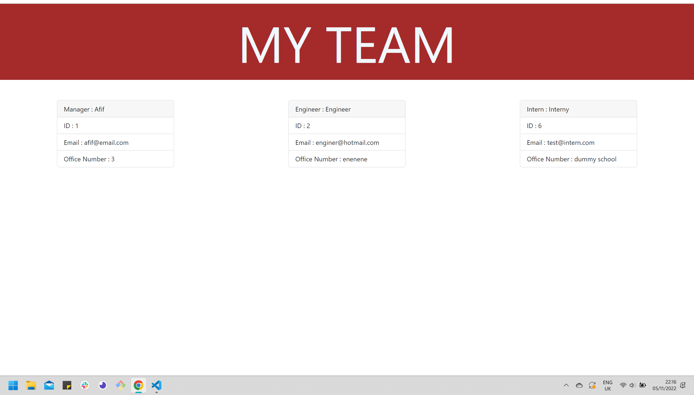

# teamp-profiles-generator

# Link to demo vid

[Link to Demo Vid](https://drive.google.com/file/d/1p6m086JSHokQC1P7YBWIcdKBDENXLGsr/view)

## Table of Contents

- [Description](#Description)
- [Usage](#Usage)
- [License](#license)
- [Contributing](#Contributing)
- [Questions](#questions)

## Project title :

Team Profile Generator

## Description :

an inquirer application to allow the user to create a html of the employees based upon the their roles, id, email and office numbers etc.

## Installation :

All dependencies are required to be installed for the use of this app

## Usage :

## Contributing ;

## linkedin :

## Github ;

Affiiiffff

## License :

Boost Software License 1.0

## Questions

If you have any questions about this projects, please contact me directly at afifpatel@hotmail.co.uk. You can view more of my projects at https://github.com/Affiiiffff.
